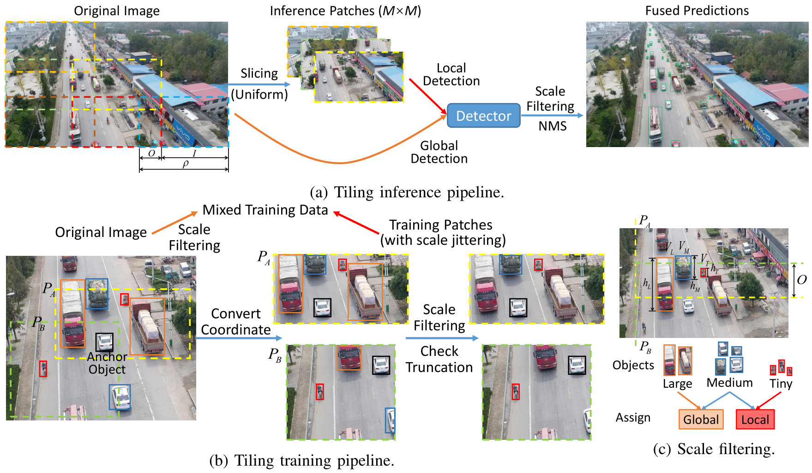

# Slicing Window YOLOv5
Official implementation of the paper "*Exploiting Efficient Tiling Detection Framework for UAV-captured images*".

This work proposes an improved tiling detection framework with competitive performance and high efficiency 
for drone object detection.


## Abstract
In this work, our contributions are listed as follows:
1) We propose an improved tiling detection framework with the mixed data strategy and scale filtering 
to avoid truncation and handle objects in all scales, and generate effective training patches by online anchor-cropping.
2) We devise two augmentations (Mosaic Plus and Crystallization Copy-paste) customized for tiling detection 
to produce more challenging drone scenarios, simulate dense clusters and alleviate the long-tail problem. 
3) The tiling framework achieves outstanding performance on both the public DOD datasets and real-world images.



## Acknowledgement and Introduction
This work is an tiling extension of the [YOLOv5](https://github.com/ultralytics/yolov5), one of the most popular 
open source frameworks general object detector.

We would like to greatly appreciate the YOLOv5 group for providing such a convenient and solid detection framework.

The tiling version of the training, validation and test scripts with corresponding utils codes are all put in `./yolo_split/`.

Except that, the usage of this project is completely same as the original YOLOv5. 


## Installation
This project is based on the Pytorch deep learning API.
By and large, the codes can run both on the Linux and Windows system.

Please refer to the installation instructions in [YOLOv5](https://github.com/ultralytics/yolov5) project.


## Data Preparation
We mainly train and validate our detectors on the [VisDrone2019-DET](http://aiskyeye.com/download/) datasets.

The pre-processing works are as following:

### Generate the VisDrone-style dataset and annotations.

Please note that if you want to test other datasets such as [UAVDT-DET](https://sites.google.com/view/grli-uavdt) or your custom data, 
first you need to convert their data structure and annotations into the VisDrone-style format.

Annotations in VisDrone-style format: x0, y0, w, h, confidence, cls, trunc, occ

    Box (x0, y0, w, h) is in the rect format and uses absolute coordinates;
    Confidence: 0 for ignored regions, 1 for valid objects;
    Cls denotes the category, which begins from 0;
    trunc and occ: 0 means none truncation/occlusion, 1 means partial truncation/occlusion, >1 means heavy truncation/occlusion


### Filter annotations and convert them into YOLO-style labels.

Annotations in YOLO-style format: cls, x, y, w, h (normalized centred coordinate)

We provide a script [yolo_split/scripts/process_visdrone.py](yolo_split/scripts/process_visdrone.py) for this.

Referring to the evaluation protocol of VisDrone, 
the objects in heavy truncation/occlusion won't participate in validation.

Thus, in this script we filter the annotations of the invalid objects as well as the ignored regions.

### Mask ignored regions (optional)

Besides, if the annotations of the val / test set label the ignored regions, 
you can use [yolo_split/scripts/img_ignore.py](yolo_split/scripts/img_ignore.py) to mask the ignored regions,
so that the model won't generate invalid predications on the regions and accordingly obtains a slight increase of the AP metrics.

### Generate .json label files for tiling training.
In tiling training, we utilize `.json` label files to store annotations and corresponding paths, 
so that we can more conveniently conduct online cropping and augmentation operations which need to read multiple images, 
such as Mosaic and copy-paste.

The script is [yolo_split/scripts/build_json.py](yolo_split/scripts/build_json.py).

We provide the files of VisDrone and UAVDT in [here](https://drive.google.com/drive/folders/10s3qfPAIWJ2nMKy_oJALFmdY8nfDEpBB?usp=sharing) for reference.

Eventually, the dataset should be organized like this:
```
|-- /home/Data/
    |-- VisDrone2019-DET
        |-- VisDrone2019-DET-train
        |-- VisDrone2019-DET-val
        |-- VisDrone2019-DET-test-dev
            |-- images  # original images (optional to mask the ignored regions)
                0000006_00159_d_0000001.jpg
                ...
            |-- annotations  # original annotations in VisDrone-style format: x0, y0, w, h, confidence, cls, truncation, occlusion
                0000006_00159_d_0000001.txt  
                ...
            |-- labels  # converted annotations in YOLO-style format: cls, x, y, w, h (normalized centred coordinate)
                0000006_00159_d_0000001.txt  
                ...
        VisDrone2019-DET-train-cls.json  # .json lable which saves objects for the copy-paste augmentation
        VisDrone2019-DET-train.json  # .json labels which save all the paths and annotations for training and validation
        VisDrone2019-DET-val.json
        VisDrone2019-DET-test.json
```

## Settings of tiling and Augmentation
We still follow the old way in YOLOv5 to load the hyper-parameters for training.

For the new parameters about image partition and additional augmentations, 
we set them in [yolo_split/config.py](yolo_split/config.py).


## Original YOLOv5
We still reserve the original training and validate scripts of YOLOv5 as the baseline.

Training: [train_ota.py](train_ota.py); Validation: [val.py](val.py); Inference: [detect.py](detect.py).


## Detection, Validation and Evaluation 
The weights of the SW-YOLOv5s, SW-YOLOv5m and SW-YOLOv5l in paper can be download in [here](https://drive.google.com/drive/folders/1BH4SMAMd1uFqHiSlPAR-P9MDHFikKJIK?usp=sharing).

Inference and validation can be conducted in [yolo_split/split_detect.py](yolo_split/split_detec.py) and [yolo_split/split_val.py](yolo_split/split_val.py).

Although we modify the metric computing codes of YOLOv5, 
we recommend using [coco_eval.py](coco_eval.py) and 
the '.json' result file generated by [yolo_split/split_val.py](yolo_split/split_val.py) 
to perform the COCO-style evaluation.

We provide a script [yolo_split/scripts/visdrone_coco_format.py](yolo_split/scripts/visdrone_coco_format.py) to produce COCO-style ground truth '.json' file.
Also, you can download the GT of VisDrone and UAVDT from our [Google Drive](https://drive.google.com/drive/folders/1Tdhr617aPBos3-DfMgCpf7G00TSwsbJn?usp=sharing).

Except a few arguments added for tiling, the usage of these scripts is completely same as the original YOLOv5.

Here are some examples:

```
python yolo_split/split_detect.py --source /home/Data/Visdrone2019-DET/VisDrone2019-DET-val/images/ --imgsz 640 --weights weights/5m-visdrone-final.pt  --with_ori True --nms_type default --augment False --name final-5m-speed --device 0 --iou-thres 0.45 --conf-thres 0.2 --view-img

python yolo_split/split_val.py --data data/VisDrone.yaml --val_sub VisDrone2019-DET-val --imgsz 640 --weights weights/5s-visdrone-final.pt  --with_ori True --nms_type default --augment False --name final-5s --device 1 --conf-thres 0.0001237 --iou-thres 0.3495518

python coco_eval.py runs/val/final-5s/final-5s-visdrone.json data/VisDrone2019-DET_val_coco.json
```

## Training
We rewrite the data pipeline of YOLOv5 in [yolo_split/split_dataset.py](yolo_split/split_dataset.py).

And we also modify the training script [yolo_split/split_train_val.py](yolo_split/split_train_val.py).

(Please note that there are several additional arguments.)

Pre-trained weights can be downloaded from [YOLOv5](https://github.com/ultralytics/yolov5).

Following original YOLOv5, we recommend using the DDP mode for training:
```
python -m torch.distributed.run --nproc_per_node 2 yolo_split/split_train_val.py --data data/VisDrone.yaml --hyp data/hyp.visdrone-split.yaml --cfg yolov5s.yaml --weights weights/yolov5s.pt --train_sub VisDrone2019-DET-train --val_sub VisDrone2019-DET-val --batch-size 32 --workers 16 --val_freq 10 --val_freq_epoch 160 --iou_type CIoU --name final-5s

python -m torch.distributed.run --nproc_per_node 2 yolo_split/split_train_val.py --data data/VisDrone.yaml --hyp data/hyp.visdrone-split.yaml --cfg yolov5m.yaml --weights weights/yolov5m.pt --train_sub VisDrone2019-DET-train --val_sub VisDrone2019-DET-val --batch-size 32 --workers 16 --val_freq 10 --val_freq_epoch 160 --iou_type EIoU --name final-5m

python -m torch.distributed.run --nproc_per_node 2 yolo_split/split_train_val.py --data data/VisDrone.yaml --hyp data/hyp.visdrone-split.yaml --cfg yolov5l.yaml --weights weights/yolov5l.pt --train_sub VisDrone2019-DET-train --val_sub VisDrone2019-DET-val --batch-size 32 --workers 16 --val_freq 10 --val_freq_epoch 160 --iou_type EIoU --name final-5l
```
